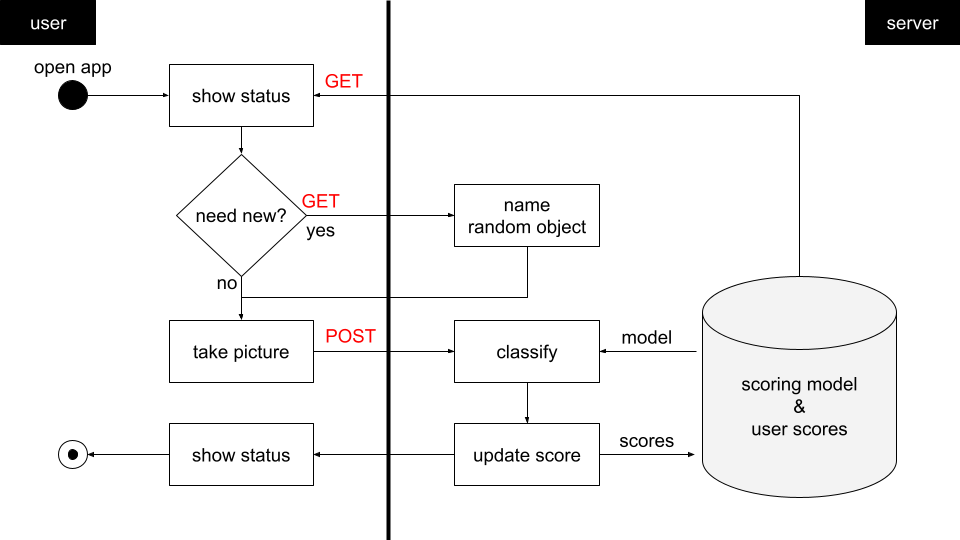

# findme

This is a scavenger hunt app created as a learning project.
It is a game where the user earns points by taking photos of randomly-assigned objects.
A server uses a CNN to judge how many points to award each photo.
The image below shows the full interaction.

Skills exercised
- Kivy (Python-based app development framework)
- Heroku deployment (server)
- AI integration (CNN-based scoring)